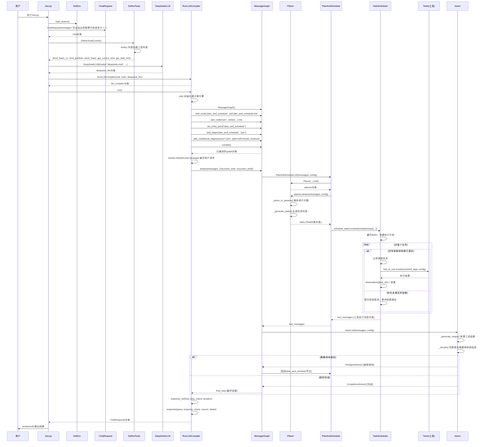

# LLMCompiler 项目架构说明

## 1. 项目概述

LLMCompiler 是一种 Agent 架构，旨在通过在DAG中快速执行任务来加快 Agent 任务的执行速度。它通过减少对 LLM 的调用次数来节省 Tokens 使用的成本，实现灵感来自《An LLM Compiler for Parallel Function Calling》。

当 Agent 需要调用大量工具时，此实现非常有用。如果您需要的工具超过 LLM 的上下文限制，您可以基于此工具扩展Agent节点。将工具分为不同的Agent并组装它们以创建更强大的 LLMCompiler。

## 2. 核心执行流程时序图

下面的时序图详细展示了`test.py`执行时的方法级别调用流程，揭示了LLMCompiler框架的工作原理：

## 3. 关键组件说明

### 3.1 核心类与方法

| 类/模块名 | 主要功能 | 关键方法 |
|----------|---------|---------|
| **RunLLMCompiler** | 框架主类，协调整个执行流程 | `init()`: 初始化图计算引擎 `run()`: 执行完整流程 `should_continue()`: 判断是否继续执行 |
| **Planer** | 任务规划器，将用户请求转换为任务DAG | `init()`: 初始化规划器 `_parse_to_params()`: 解析用户查询 `_generate_tasks()`: 生成任务列表 |
| **PlanAndSchedule** | 任务规划与调度器 | `init()`: 初始化 `plan()`: 生成任务计划 `plan_output()`: 生成计划并执行 |
| **TaskScheduler** | 任务调度器，执行具体任务 | `schedule_tasks.invoke()`: 调度任务执行 `_execute_task()`: 执行单个任务 `_resolve_arg()`: 解析任务参数 |
| **Joiner** | 结果处理与决策器 | `init()`: 初始化 `_generate_output()`: 处理工具结果 `_decide()`: 判断下一步行动 |

### 3.2 工具调用流程

1. **任务规划**：Planer分析用户请求，生成包含工具调用的任务DAG
2. **参数解析**：TaskScheduler解析每个任务的参数，处理依赖关系
3. **工具执行**：调用相应工具的`invoke()`方法，传入解析后的参数
4. **结果收集**：将工具执行结果存储在`observations`字典中
5. **结果合并**：Joiner处理所有工具执行结果，生成最终响应

### 3.3 并行执行机制

LLMCompiler的核心优势在于能够并行执行独立任务，它通过以下机制实现：

1. **依赖分析**：在DAG中识别没有依赖或依赖已满足的任务
2. **线程池调度**：使用`ThreadPoolExecutor`并行执行独立任务
3. **依赖等待**：对于存在未满足依赖的任务，等待依赖完成后再执行
4. **结果同步**：使用`observations`字典安全地存储和共享任务结果

## 4. 扩展开发指南

### 4.1 添加新工具

1. 创建继承自`BaseTool`的工具类
2. 实现`_run()`和`_arun()`方法
3. 在`DefineTools.tools()`方法中注册工具

### 4.2 自定义LLM

1. 扩展基础LLM类
2. 实现必要的接口方法
3. 在创建`RunLLMCompiler`实例时传入自定义LLM

### 4.3 自定义提示词

修改`prompt.py`中的提示词模板，自定义规划器和合并器的行为。

## 5. 总结

LLMCompiler通过基于DAG的任务规划和并行执行，显著提高了Agent的执行效率。它的核心优势在于：

1. 减少对LLM的调用次数，节省Token成本
2. 并行执行独立任务，提高执行速度
3. 清晰的任务依赖管理，保证结果正确性
4. 灵活的工具扩展机制，支持各种复杂场景

通过上述时序图和组件说明，可以清晰地了解LLMCompiler的工作原理和执行流程，为进一步开发和使用提供指导。
